## 1. Intro to Ethereum

### 1. Blockchain là gì?

* Một blockchain là cơ sở dữ liệu công khai được **chia sẻ** và **cập nhật** bởi nhiều máy tính trong một mạng lưới. 
* “Block” là nhóm dữ liệu (ví dụ các giao dịch) được lưu theo khối.
* “Chain” vì mỗi khối tham chiếu tới khối cha, tạo ra chuỗi; nếu muốn thay đổi dữ liệu trong một khối, phải thay tất cả các khối sau
* Các máy tính trong mạng gọi là “nodes” (nút), và cần có cơ chế đồng thuận để xác nhận các khối mới


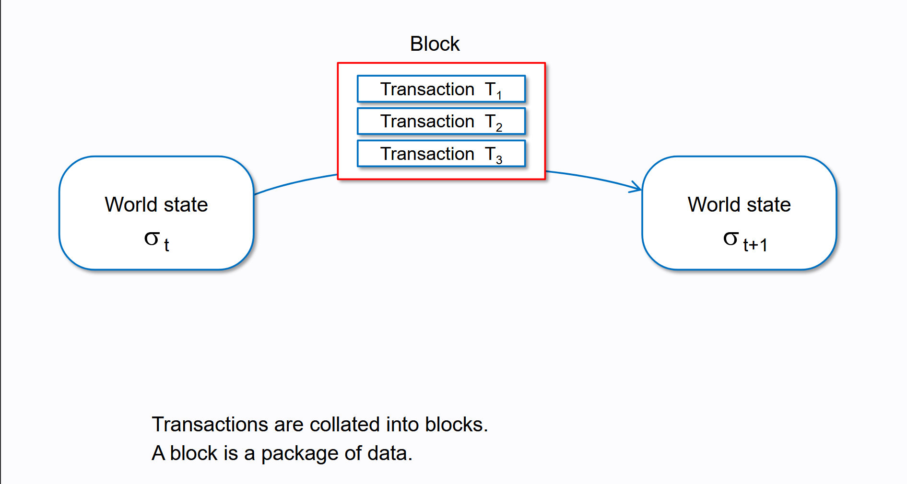


---

### 2. Ethereum là gì?

* Nó là nền tảng để xây dựng các ứng dụng và tổ chức theo kiểu phi tập trung (decentralised), không cần cấp phép (permissionless), và có khả năng chống kiểm duyệt (censorship-resistant).
* Trung tâm của Ethereum là máy ảo gọi là Ethereum Virtual Machine (EVM) — mỗi node giữ trạng thái của EVM.
* Người tham gia mạng có thể gửi yêu cầu thực thi tính toán (tức giao dịch) tới EVM; sau đó những node khác kiểm tra, thực thi và cập nhật trạng thái.
* Giao dịch và trạng thái EVM được lưu trữ và đồng thuận trên blockchain.


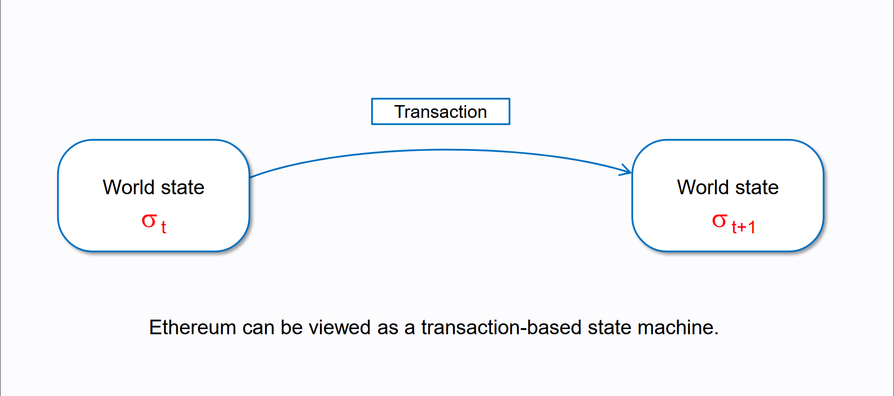


---

### 3. Ether (ETH) là gì?

* Ether (ký hiệu ETH) là đồng tiền gốc của Ethereum.
* Công dụng chính: tạo ra “thị trường cho tính toán” — người tham gia khi gửi giao dịch phải trả ETH như một khoản “phí” cho mạng để thực thi.
* Phí này giúp đảm bảo rằng người dùng không thể gửi các tính toán vô tận làm tắc mạng, vì họ phải trả cho tài nguyên sử dụng.
* ETH còn được sử dụng để:

  * Thưởng cho các validator (người xác thực) trong PoS
  * Validator phải stake ETH như khoản thế chấp chống lại hành vi sai
  * Dùng để tham gia cơ chế bỏ phiếu trong đồng thuận (trọng số stake)

---

### 4. Hợp đồng thông minh (Smart contracts) là gì?

* Hợp đồng thông minh là chương trình (code) được đăng tải lên EVM và người dùng có thể gọi thực thi với các tham số khác nhau.
* Ví dụ đơn giản: hợp đồng “mua bán” — khi người dùng gửi ETH tới hợp đồng, hợp đồng có thể tạo và chuyển tài sản số.
* Bất kỳ ai cũng có thể triển khai hợp đồng lên mạng (phải trả phí ETH) và người khác có thể gọi nó (cũng phải trả phí) để thực thi code.

---

### 5. Thuật ngữ quan trọng

- External Actor: A person or other entity able to interface to an Ethereum node, but external to the world of
Ethereum. It can interact with Ethereum through depositing signed Transactions and inspecting the blockchain
and associated state. Has one (or more) intrinsic Accounts.
- Address: A 160-bit code used for identifying Accounts.
- Account: Accounts have an intrinsic balance and transaction count maintained as part of the Ethereum state.
They also have some (possibly empty) EVM Code and a (possibly empty) Storage State associated with them.
Though homogenous, it makes sense to distinguish between two practical types of account: those with empty
associated EVM Code (thus the account balance is controlled, if at all, by some external entity) and those with
non-empty associated EVM Code (thus the account represents an Autonomous Object). Each Account has a
single Address that identifies it.
- Transaction: A piece of data, signed by an External Actor. It represents either a Message or a new Autonomous
Object. Transactions are recorded into each block of the blockchain.


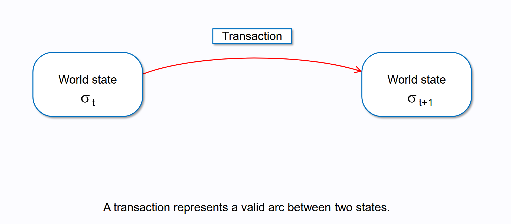


- Autonomous Object: A notional object existent only within the hypothetical state of Ethereum. Has an intrinsic
address and thus an associated account; the account will have non-empty associated EVM Code. Incorporated
only as the Storage State of that account.
- Storage State: The information particular to a given Account that is maintained between the times that the
Account’s associated EVM Code runs.
- Message: Data (as a set of bytes) and Value (specified as Ether) that is passed between two Accounts, either
through the deterministic operation of an Autonomous Object or the cryptographically secure signature of the
Transaction.
- Message Call: The act of passing a message from one Account to another. If the destination account is associated
with non-empty EVM Code, then the VM will be started with the state of said Object and the Message acted
upon. If the message sender is an Autonomous Object, then the Call passes any data returned from the VM
operation.
- Gas: The fundamental network cost unit. Paid for exclusively by Ether (as of PoC-4), which is converted freely to
and from Gas as required. Gas does not exist outside of the internal Ethereum computation engine; its price is
set by the Transaction and validators are free to ignore Transactions whose Gas price is too low.
Contract: Informal term used to mean both a piece of EVM Code that may be associated with an Account or an
Autonomous Object.
- Object: Synonym for Autonomous Object.
- App: An end-user-visible application hosted in the Ethereum Browser.
- Ethereum Browser: (aka Ethereum Reference Client) A cross-platform GUI of an interface similar to a simplified
browser that is able to host sandboxed applications whose backend is purely on the Ethereum
protocol.
- Ethereum Virtual Machine: (aka EVM) The virtual machine that forms the key part of the execution model
for an Account’s associated EVM Code.
Ethereum Runtime Environment: (aka ERE) The environment which is provided to an Autonomous Object
executing in the EVM. Includes the EVM but also the structure of the world state on which the EVM relies for
certain I/O instructions including CALL & CREATE.
- EVM Code: The bytecode that the EVM can natively execute. Used to formally specify the meaning and
ramifications of a message to an Account.
- EVM Assembly: The human-readable form of EVM-code.
- LLL: The Lisp-like Low-level Language, a human-writable language used for authoring simple contracts and general
low-level language toolkit for trans-compiling to.

## 2. Intro to Ether

### 1. “Tiền điện tử” là gì?

* A cryptocurrency is a medium of exchange secured by a blockchain-based ledger.

* A medium of exchange is anything widely accepted as payment for goods and services, and a ledger is a data store that keeps track of transactions. Blockchain technology allows users to make transactions on the ledger without reliance upon a trusted third party to maintain the ledger.
---

### 2. Ether là gì?

* Ether (ETH) là đồng tiền điện tử được dùng trên mạng Ethereum.
* Về cơ bản:

  * Đây là **hình thức duy nhất được chấp nhận** để trả cho phí giao dịch (gas fees) trên mạng Ethereum.
  * Sau việc hoàn tất sự kiện “The Merge”, ether cũng được dùng để **đề cử và xác thực** các khối trên mạng chính. 
  * Ether còn được sử dụng như **tài sản thế chấp** trong các thị trường tài chính phi tập trung (DeFi), là đơn vị tính giá trong thị trường NFT, được trả như dịch vụ hoặc hàng hoá thực — tức nó không chỉ là “phí”.
* Vì mạng Ethereum có “computing power.” hữu hạn, ether giúp mạng đặt “fees” cho việc sử dụng tài nguyên đó — tránh việc một ứng dụng hoặc hợp đồng thông minh (dApp) chiếm sạch mọi tài nguyên và làm tắc mạng.

---

### 3. Minting

* Quá trình “minting” là cách ether mới được tạo ra trên ledger của Ethereum — người dùng không thể tự tạo ether. 
* Ether mới được phát hành như phần thưởng cho mỗi khối được đề xuất và tại mỗi “epoch checkpoint” cho các validator hoạt động trong cơ chế đồng thuận.
* Lượng phát hành phụ thuộc vào số validator và lượng ETH họ đã stake.
* Khoảng 1/8 lượng phát hành đi tới người đề xuất khối; phần còn lại được phân phối cho các validator khác.

---

### 4. Burning

* Bên cạnh việc tạo ra, ether có thể bị **hủy bỏ vĩnh viễn (burn)** qua cơ chế mạng.
* Cụ thể: khi người dùng gửi giao dịch, họ trả một “phí cơ bản” (base fee) — phần này được đốt và **loại khỏi lưu thông**.
* Khi nhu cầu mạng cao, lượng ether bị đốt có thể **nhiều hơn lượng mới phát hành**, giúp bù đắp phát hành — tức có thể tạo “cản phát hành” hoặc giảm phát.
* Việc đốt phí cơ bản cũng giúp **ngăn chặn người đề xuất khối lợi dụng**: nếu họ nhận phí cơ bản thì có thể tự thực hiện giao dịch mình miễn phí, và tăng phí cho các người dùng khác, tạo mất công bằng.
---

### 5. Các mệnh giá của Ether

* Vì nhiều giao dịch có giá trị nhỏ, Ether có các mệnh giá khác nhau để dễ dùng.

|           **Giá trị (tính theo Wei)** | **Lũy thừa (10ⁿ)** | **Tên thông dụng (Common name)** | **Tên theo SI (SI name)**       | **Giải thích / Ghi chú**                                     |
| ---: | ---: | --- | --- | --- |
|                                 **1** |                10⁰ | **Wei**                          | **Wei**                         | Đơn vị nhỏ nhất của Ether — 1 ETH = 10¹⁸ Wei                 |
|                             **1,000** |                10³ | **Babbage**                      | **Kilowei** hoặc **Femtoether** | Tên theo nhà khoa học Charles Babbage (cha đẻ máy tính)      |
|                         **1,000,000** |                10⁶ | **Lovelace**                     | **Megawei** hoặc **Picoether**  | Theo Ada Lovelace, lập trình viên đầu tiên trong lịch sử     |
|                     **1,000,000,000** |                10⁹ | **Shannon**                      | **Gigawei** hoặc **Nanoether**  | Theo Claude Shannon, cha đẻ lý thuyết thông tin              |
|                 **1,000,000,000,000** |               10¹² | **Szabo**                        | **Microether** hoặc **Micro**   | Theo Nick Szabo, người tiên phong khái niệm “smart contract” |
|             **1,000,000,000,000,000** |               10¹⁵ | **Finney**                       | **Milliether** hoặc **Milli**   | Theo Hal Finney, người nhận giao dịch Bitcoin đầu tiên       |
|         **1,000,000,000,000,000,000** |               10¹⁸ | **Ether**                        | **Ether**                       | Đơn vị chuẩn (1 ETH = 10¹⁸ Wei)                              |
|     **1,000,000,000,000,000,000,000** |               10²¹ | **Grand**                        | **Kiloether**                   | 1 Grand = 1,000 Ether                                        |
| **1,000,000,000,000,000,000,000,000** |               10²⁴ | *(không tên thông dụng)*         | **Megaether**                   | 1 Megaether = 1,000,000 Ether                                |

## 3. Intro to dapps

### 1. Định nghĩa dapp

* Một dapp là ứng dụng mà phần backend chạy trên mạng phi tập trung (peer-to-peer) thay vì máy chủ tập trung.
* Giao diện frontend có thể viết bằng bất kỳ ngôn ngữ nào và có thể được host trên nơi lưu trữ phân quyền như IPFS.
* Các đặc tính chính: 
    - **Decentralized** phi tập trung
    - **Deterministic** thực thi luôn như dự kiến
    - **Turing complete** có thể thực hiện mọi hành động khi có đủ tài nguyên
    - **Isolated** được thực thi trong môi trường ảo như Ethereum Virtual Machine – EVM, nên nếu gặp bug thì nó vẫn sẽ không ảnh hưởng tới hoạt động của mang blockchain

---

### 2. Lợi ích khi phát triển dapp

* Không bị downtime: Sau khi smart contract được deploy, luôn có thể phục vụ người dùng mà không cần lo về các hành vi xấu.
* Quyền riêng tư: Người dùng/nhà phát triển không nhất thiết phải cung cấp danh tính thực để sử dụng hoặc tạo dapp.
* Kháng kiểm duyệt: Không có một thực thể duy nhất nào có thể chặn việc người dùng gửi giao dịch, triển khai dapp hoặc đọc dữ liệu từ blockchain.
* Tính toàn vẹn dữ liệu: Dữ liệu trên blockchain bất biến và không thể bị làm giả.
* Tính tin cậy không cần trung gian (trustless): Smart contract có thể được phân tích, thực thi như dự kiến mà không cần phải tin một tổ chức trung tâm. 

---

### 3. Những hạn chế/khó khăn của dapp

* Bảo trì khó khăn: Khi deploy smart contract và dữ liệu lên blockchain thì rất khó để thay đổi hoặc sửa lỗi sau đó.
* Tải & hiệu năng thấp: Vì mỗi node phải chạy và lưu mọi giao dịch, do đó overhead rất lớn; mạng hiện tại của Ethereum chỉ xử lý khoảng 10–15 giao dịch/giây. 
* Trải nghiệm người dùng có thể kém: Người dùng cuối có thể phải thiết lập công cụ phức tạp để tương tác blockchain một cách “an toàn”.
* Nguy cơ trung quyền (centralisation) ngầm: Mặc dù nền tảng là phi tập trung, nhưng nếu frontend hoặc logic quan trọng vẫn bị đặt trên server tập trung thì nhiều lợi ích bị mất.

## 4. Etherium Account

---

### 1. Khái niệm cơ bản

* Một *tài khoản* Ethereum là một thực thể có số dư ETH và có khả năng gửi “messages” (giao dịch) trên mạng blockchain, có khả năng nhận, giữ và gửi ETH hoặc token, và tương tác với các hợp đồng đã triển khai.


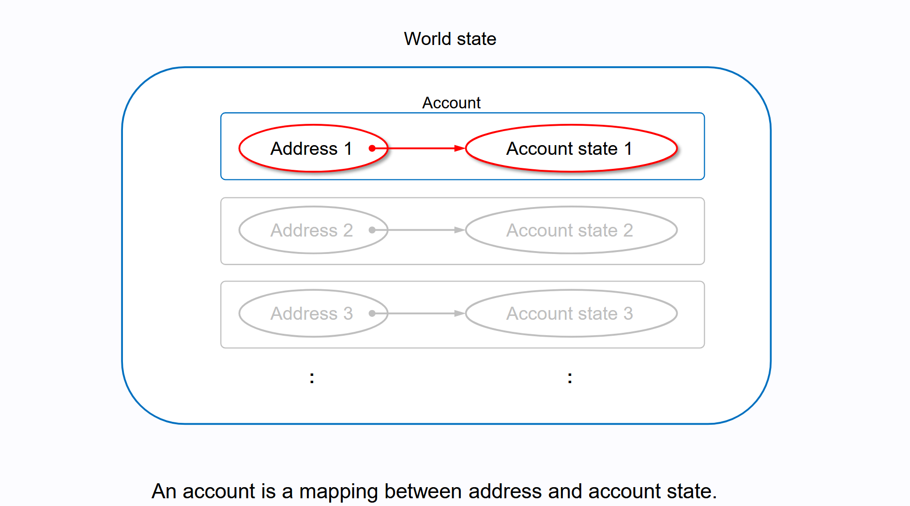


---

### 2. Hai loại tài khoản

* **Externally-Owned Account (EOA)**: Tài khoản do người dùng kiểm soát, có private key.
* **Contract Account**: Tài khoản được deploy dưới dạng smart contract, được điều khiển bởi code chứ không phải private key.

* Sự khác biệt chính:

  * EOA: 
    * Tạo tài khoản EOA miễn phí
    * Có thể khởi tạo giao dịch
    * Giao dịch giữa 2 tài khoản EOA chỉ có thể dùng để chuyển ETH/token
    * Được tạo thành từ khóa public và công khai để kiểm soát tài khoản

  * Contract account:
    * Tạo tài khoản contract tốn phí
    * Chỉ có thể gửi tin nhắn phản hồi khi nhận được giao dịch
    * Giao dịch từ EOA có thể thực thi code trong tài khoản contract
    * Contract không có cặp khóa nhưng thay vào đó nó được kiểm soát bởi code của nó


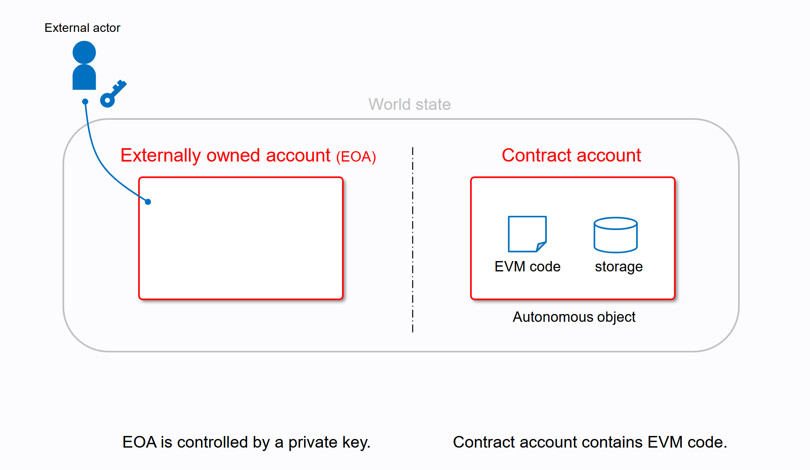


---

### 3. Thành phần của một tài khoản


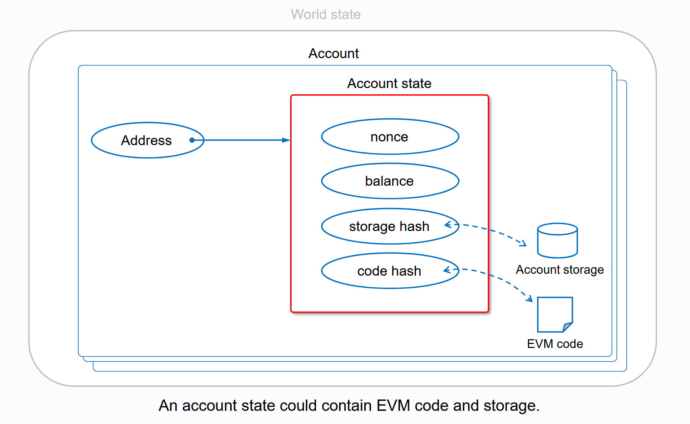


Tài khoản Ethereum có 4 trường chính:

* `nonce`: bộ đếm số giao dịch đã gửi (EOA) hoặc số hợp đồng tạo ra (contract account).
* `balance`: số lượng *wei* mà tài khoản đang sở hữu (1 ETH = 10^18 wei).
* `codeHash`: chỉ có ở tài khoản hợp đồng — là hash của code chạy trong EVM. Với EOA, codeHash là hash của chuỗi trống.
* `storageRoot`: hash gốc của Merkle-Patricia Trie đại diện lưu trữ nội dung trạng thái của tài khoản (chủ yếu hợp đồng).


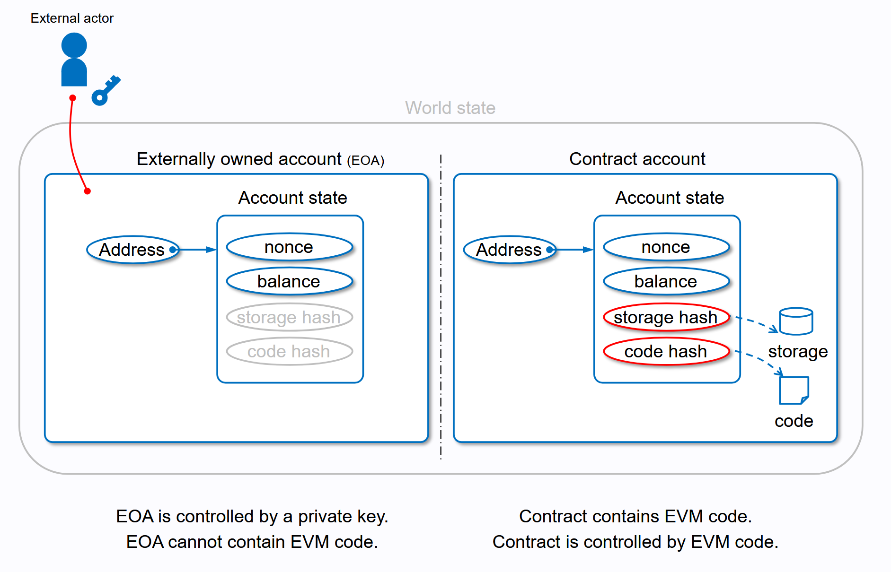


---

### 4. EOA và cặp khóa

* Với EOA: tài khoản gồm cặp khóa **private key** và **public key**. Private key dùng để ký giao dịch, public key dùng để kiểm chứng.
* Bạn không thực sự “nắm giữ” ETH; bạn nắm private key kiểm soát tài khoản mà mạng Ethereum ghi nhận số dư.
* Ví dụ quy trình: private key → public key (qua Elliptic Curve Digital Signature Algorithm) → địa chỉ (lấy 20 byte cuối của hash keccak-256 public key và thêm `0x`).
* Ví dụ địa chỉ: `0x5e97870f263700f46aa00d967821199b9bc5a120`

---

### 5. Tạo tài khoản

* Hầu hết thư viện sẽ sinh ngẫu nhiên một private key.
* Private key thường là 64 ký tự hex, có thể mã hóa bằng mật khẩu.

* Hợp đồng khi deploy cũng có địa chỉ 42 ký tự hex (20 byte + `0x`) giống EOA.
* Địa chỉ thường được xác định bằng địa chỉ người tạo và nonce số giao dịch/giao thức khi deploy.


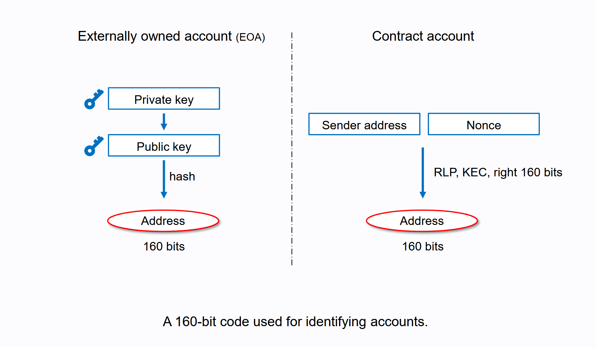


## 5. Transactions

### 1. Khái niệm chung

* Giao dịch là **tin nhắn được ký số** bởi một tài khoản có quyền thuộc dạng EOA (externally-owned account) — tức là tài khoản cá nhân, không phải là hợp đồng thông minh
* Giao dịch được gửi tới mạng và khi được xử lý sẽ thay đổi trạng thái (state) toàn mạng của Ethereum Virtual Machine (EVM) — ví dụ: chuyển ETH, gọi một hợp đồng, khởi tạo hợp đồng mới.
* Ethereum được xem như một “máy trạng thái đơn hình” (singleton state machine) toàn cầu — tức là có một trạng thái chung được tất cả node chia sẻ, và giao dịch chính là cái khiến trạng thái này thay đổi.


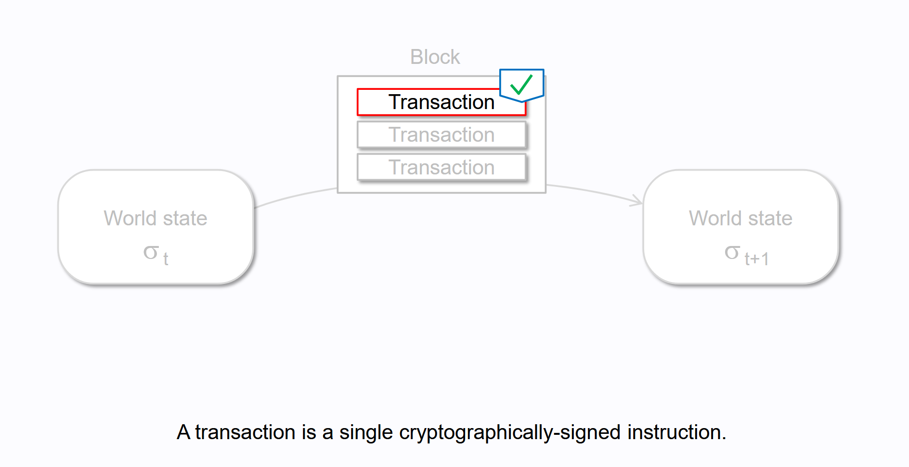


```py
{
  "jsonrpc": "2.0",
  "id": 2,
  "result": {
    "raw": "0xf88380018203339407a565b7ed7d7a678680a4c162885bedbb695fe080a44401a6e4000000000000000000000000000000000000000000000000000000000000001226a0223a7c9bcf5531c99be5ea7082183816eb20cfe0bbc322e97cc5c7f71ab8b20ea02aadee6b34b45bb15bc42d9c09de4a6754e7000908da72d48cc7704971491663",
    "tx": {
      "nonce": "0x0",
      "maxFeePerGas": "0x1234",
      "maxPriorityFeePerGas": "0x1234",
      "gas": "0x55555",
      "to": "0x07a565b7ed7d7a678680a4c162885bedbb695fe0",
      "value": "0x1234",
      "input": "0xabcd",
      "v": "0x26",
      "r": "0x223a7c9bcf5531c99be5ea7082183816eb20cfe0bbc322e97cc5c7f71ab8b20e",
      "s": "0x2aadee6b34b45bb15bc42d9c09de4a6754e7000908da72d48cc7704971491663",
      "hash": "0xeba2df809e7a612a0a0d444ccfa5c839624bdc00dd29e3340d46df3870f8a30e"
    }
  }
}
```

trong đó:
* raw là RLP encoded của transaction
* tx là transaction

---

### 2. Cấu trúc của một giao dịch

Một giao dịch trong Ethereum gồm các trường chính (và tùy theo phiên bản có thêm trường mới). Những trường cơ bản gồm:

* `nonce`: số thứ tự giao dịch của tài khoản gửi — để tránh gửi lặp và để định thứ tự.
* `to`: địa chỉ người nhận (nếu là chuyển ETH hoặc gọi hợp đồng) hoặc có thể là null/không có nếu là triển khai hợp đồng.
* `value`: lượng ETH (đơn vị wei) gửi đi.
* `data` (input): trường dữ liệu tùy chọn — thường dùng khi gọi hợp đồng hoặc triển khai hợp đồng (chứa bytecode hoặc calldata)
* `gasLimit` (hoặc `gas` trong phiên bản cũ): giới hạn lượng “gas” người gửi sẵn sàng chi trả để thực thi giao dịch.
* `gasPrice` (phiên bản cũ) hoặc `maxFeePerGas`, `maxPriorityFeePerGas` (phiên bản mới theo EIP-1559): là mức giá mà người gửi đồng ý trả cho mỗi đơn vị gas.
* `signature` — gồm các thành phần `v`, `r`, `s`: ký số ECDSA của sender để xác thực quyền gửi.
* Ngoài ra có các trường khác như `chainId` (để chống replay giữa mạng) trong các phiên bản nâng cấp. 


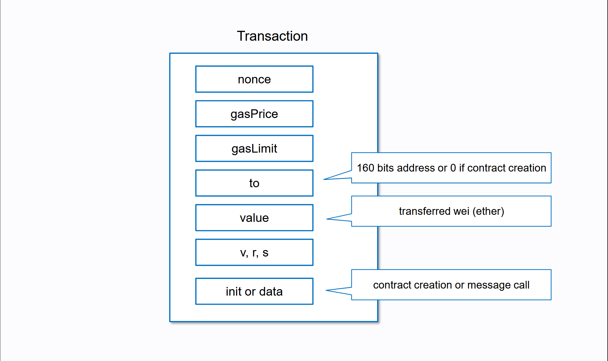


---

### 3. Các loại giao dịch
* Có các loại giao dịch sau:

  * Giao dịch chuyển ETH giữa hai EOA.
  * Giao dịch “triển khai hợp đồng”: `to` = null và `data` = bytecode hợp đồng.


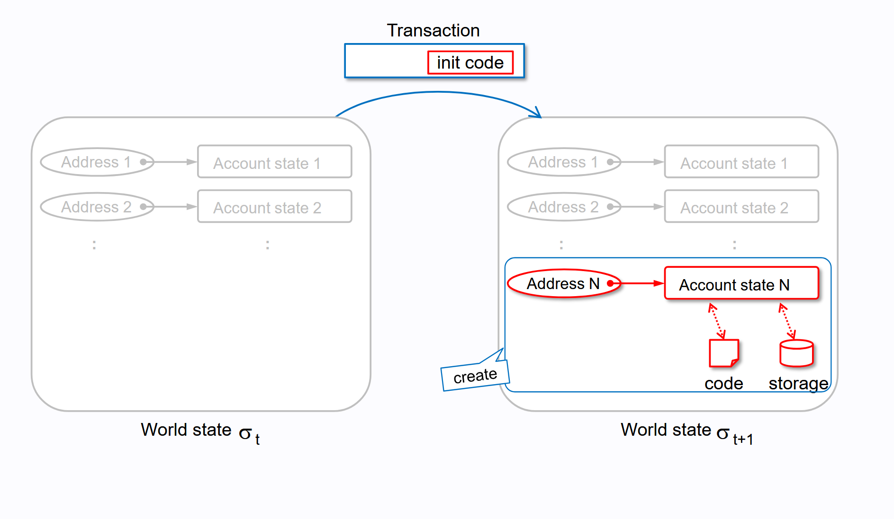


  * Giao dịch “gọi hợp đồng đã có”: `to` = địa chỉ hợp đồng, `data` chứa hàm và tham số.


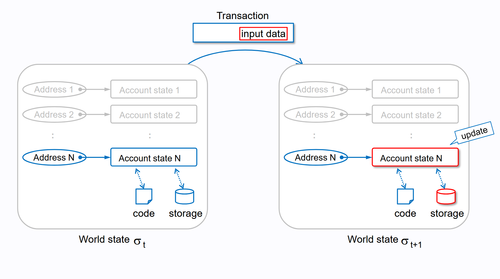


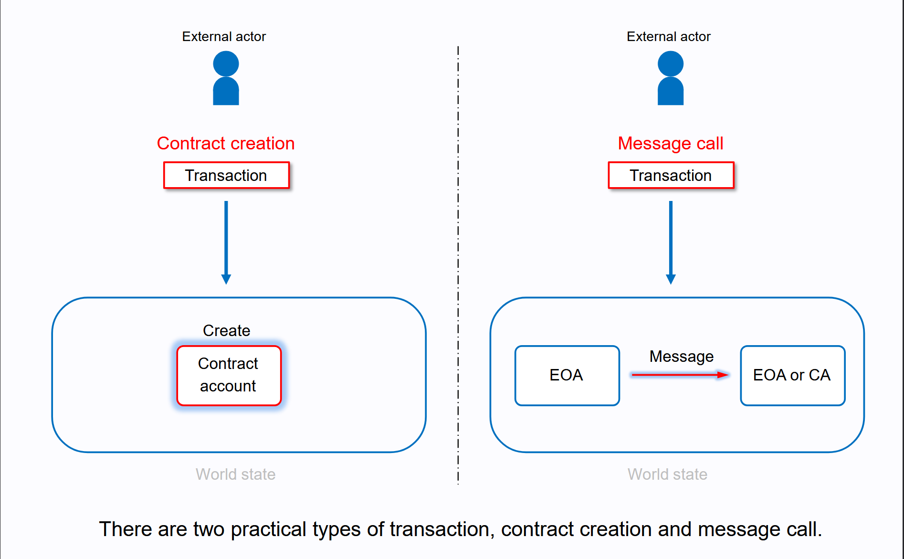


---

### 4. Phí giao dịch

* “Gas” là đơn vị đo lường lượng công việc tính toán mà EVM sẽ thực thi. Mỗi opcode có một mức gas cost nhất định.
* `gasLimit` là số đơn vị gas tối đa mà người gửi chấp nhận. Nếu giao dịch dùng ít hơn, phần dư được hoàn lại.
* Với mô hình EIP-1559:

  * Có `baseFeePerGas` (cơ bản) do block quyết định, bị đốt (burned).
  * `maxPriorityFeePerGas` (tip cho validator) — người gửi có thể đặt để khuyến khích nhanh được xử lý.
  * `maxFeePerGas` là tổng tối đa người gửi sẵn sàng trả cho mỗi đơn vị gas (bao gồm base fee + priority fee).
* Ví dụ: nếu base fee = 190 gwei và tip = 10 gwei, và giao dịch dùng 21.000 gas (ví dụ là chuyển ETH đi đơn giản), phí = (190 + 10) × 21.000 = 4.200.000 gwei ≈ 0.0042 ETH.

---

### 5. Tương tác với hợp đồng thông minh (Smart Contract Interactions)

* Trường `data` (calldata) trong giao dịch thường chứa selector hàm (4 byte đầu) và các tham số mã hóa theo chuẩn ABI của Solidity/Vyper.
* Ví dụ: selector `0xa9059cbb` chỉ hàm `transfer(address,uint256)` trong chuẩn ERC-20.


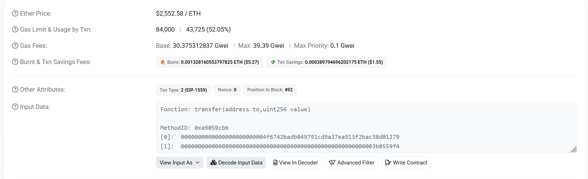


* Khi gọi các hàm chỉ đọc (view/pure) thì thường không cần gửi giao dịch – có thể dùng `eth_call` và miễn phí gas (vì không thay đổi trạng thái).

vòng đời của 1 transaction:
1. Tài khoản gửi giao dịch (ký và broadcast) → tạo một hash giao dịch.
2. Giao dịch vào mempool của các node đang chờ được đưa vào block.
3. Validator chọn giao dịch, đưa vào block, thực thi nó trong EVM và cập nhật trạng thái.
4. Sau khi block được xác thực và “finalized” trong cấu trúc proof-of-stake, giao dịch được xem là chắc chắn và không thể bị đảo ngược. 

Dưới đây là tóm tắt nội dung chính của trang “Blocks” trên Ethereum Developer Docs (cập nhật 22 Oct 2025). ([ethereum.org][1])

---
## 6. Blocks

### 1. Blocks

* Một **khối (block)** trên Ethereum là một nhóm các giao dịch (transactions) kèm theo hàm băm (hash) của khối trước — điều này tạo nên chuỗi khối (blockchain). 
* Việc liên kết các khối như vậy giúp bất kỳ thay đổi nào trong lịch sử sẽ làm thay đổi tất cả các khối sau đó — từ đó tăng tính bảo mật và chống giả mạo. 

---

### 2. Tại sao phải có khối?

* Mạng Ethereum cần mọi người tham gia (nodes) đồng bộ với cùng một “trạng thái” chung và lịch sử giao dịch chính xác → việc gom nhiều giao dịch vào khối giúp đồng bộ hóa hiệu quả hơn.
* Mặc dù có thể có nhiều giao dịch mỗi giây, khối chỉ được tạo ra mỗi **~12 giây** (một “slot”) trên Ethereum sau khi chuyển sang Proof-of-Stake.


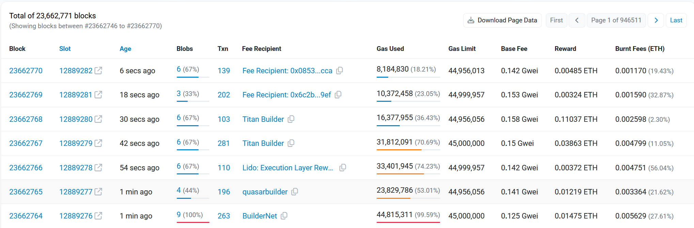


---

### 3. Cách khối hoạt động

* Mỗi khối có tham chiếu tới khối trước nó và các giao dịch bên trong khối cũng được đặt thứ tự.
* Khi một validator được chọn để đề xuất khối, họ gom các giao dịch, chạy chúng để cập nhật trạng thái và truyền ra mạng. Các node khác chạy lại các giao dịch để xác nhận tính đúng đắn, rồi thêm khối vào chuỗi của mình. 

---

### 4.Proof-of-Stake (PoS)

* Trên Ethereum khi sử dụng PoS:

  * Validator cần stake 32 ETH làm tài sản thế để chịu trách nhiệm với hành vi không tốt
  * Mỗi **slot** (12 giây) sẽ có một validator được chọn ngẫu nhiên để đề xuất khối.
  * Các validator khác khi nhận khối sẽ xác minh lại toàn bộ giao dịch để xem trạng thái mới khớp với `state_root` được chỉ định không.
  * Nếu hai khối khác nhau xuất hiện cho cùng slot, validator dùng thuật toán “fork-choice” để chọn khối được hỗ trợ bởi nhiều stake nhất.

---

### 5. Những gì có trong một khối
Từ data từ những trang web này ta có thể thấy:
  * https://developers.coindesk.com/documentation/data-api/onchain_v1_block_2_raw

  * https://etherscan.io/block/23665518


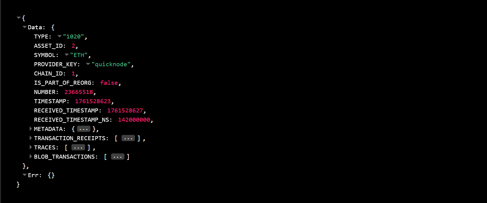


các trường trong một blocks sẽ như sau:

| Trường                  | Giá trị       | Ý nghĩa                                                                                                                  |
| --- | --- | --- |
| `TYPE`                  | `"1020"`      | Mã loại dữ liệu. Với QuickNode, `1020` thường là **Block Event Type** (một block mới được thêm vào).                     |
| `ASSET_ID`              | `2`           | ID nội bộ biểu thị tài sản. Thường `2` = **Ethereum Mainnet (ETH)**.                                                     |
| `SYMBOL`                | `"ETH"`       | Biểu tượng chuỗi hoặc token — ở đây là **ETH**.                                                                          |
| `PROVIDER_KEY`          | `"quicknode"` | Nguồn dữ liệu (provider) đang gửi event.                                                                                 |
| `CHAIN_ID`              | `1`           | Ethereum Mainnet (Chain ID 1).                                                                                           |
| `IS_PART_OF_REORG`      | `false`       | Cho biết block này **không thuộc một chain reorg** (không bị thay thế bởi chuỗi khác).                                   |
| `NUMBER`                | `23665518`    | **Số thứ tự block** (block height).                                                                                      |
| `TIMESTAMP`             | `1761528623`  | **Thời gian tạo block (epoch seconds)** — tương ứng với `27/10/2025 21:10:23 GMT+7` (ước tính).                          |
| `RECEIVED_TIMESTAMP`    | `1761528627`  | Thời điểm node nhận được block, cũng ở epoch seconds.                                                                    |
| `RECEIVED_TIMESTAMP_NS` | `142000000`   | Số nano-giây bổ sung (độ chính xác cao khi ghi log).                                                                     |
| `METADATA`              | `{}`          | Thường chứa thông tin phụ thêm, ở đây trống.                                                                             |
| `TRANSACTION_RECEIPTS`  | `[]`          | Danh sách **biên nhận giao dịch** trong block — hiện trống (có thể node chưa đồng bộ phần này hoặc block không chứa tx). |
| `TRACES`                | `[]`          | Danh sách **trace** (EVM call traces) — trống.                                                                           |
| `BLOB_TRANSACTIONS`     | `[]`          | Danh sách **EIP-4844 blob transactions** (proto-danksharding) — trống.                                                   |

các trường trong `METADATA`:

| Trường                  | Giá trị                                                                                    | Giải thích                                                          |
| --- | --- | --- |
| `baseFeePerGas`         | `0x79481da` → **127,999,066 wei (~0.000000128 Gwei)**                                      | Base fee EIP-1559 của block.                                        |
| `blobGasUsed`           | `0x120000` → **1,179,648**                                                                 | Lượng “blob gas” đã dùng (EIP-4844 - proto-danksharding).           |
| `difficulty`            | `0x0`                                                                                      | Luôn là 0 kể từ khi Ethereum chuyển sang PoS (The Merge).           |
| `excessBlobGas`         | `0x1e0000` → **1,966,080**                                                                 | Gas dư trong tính toán blob gas limit.                              |
| `extraData`             | `0xe29ca82051756173617220287175617361722e77696e2920e29ca8` | Dòng mô tả tự do từ validator/relay.                                |
| `gasLimit`              | `0x2aea4ea` → **45,200,874**                                                               | Tổng gas có thể dùng trong block.                                   |
| `gasUsed`               | `0xf3177f` → **15,949,567**                                                                | Lượng gas đã thực sự dùng.                                          |
| `hash`                  | `0x071c5649b4e79c4eadf5f94375d37725378bdfbfccf7a1a9557f39d90b483926`                       | Hash duy nhất của block.                                            |
| `logsBloom`             | (chuỗi dài)                                                                                | Bloom filter dùng để tra cứu nhanh log event.                       |
| `miner`                 | `0x396343362be2a4da1ce0c1c210945346fb82aa49`                                               | Địa chỉ validator (trong PoS: block proposer).                      |
| `mixHash`               | `0xb0545768...`                                                                            | Hash giả định để tương thích backward (không còn ý nghĩa mining).   |
| `nonce`                 | `0x0000000000000000`                                                                       | Không còn ý nghĩa sau PoS, giữ nguyên 0.                            |
| `number`                | `0x1691b6e` → 23,665,518                                                                   | Số block dưới dạng hex.                                             |
| `parentBeaconBlockRoot` | `0x0879a62915c08339751b257d1c3702ab13c44f1cced259148610b233f4ab4f2d`                       | Hash của beacon block gốc tương ứng (liên kết với consensus layer). |
| `parentHash`            | `0x8ecf38194bb6d5bf7452da492bae8cff7d35bb1d608996916dadd9dd457a79a9`                       | Hash block cha.                                                     |
| `receiptsRoot`          | `0xb9abacf2632784539f99da02258936f181b0ce129aba2ca2dd75ff6c6ec43b8c`                       | Root của tất cả receipt trong block (trống nếu không có tx).        |
| `requestsHash`          | `0xe3b0c44298fc1c149afbf4c8996fb92427ae41e4649b934ca495991b7852b855`                       | Hash rỗng (`keccak256("")`), nghĩa là không có “requests”.          |
| `sha3Uncles`            | `0x1dcc4de8dec75d7aab85b567b6ccd41ad312451b948a7413f0a142fd40d49347`                       | Giá trị mặc định khi **không có uncle blocks**.                     |
| `size`                  | `0x1228c` → **74,764 bytes (~73 KB)**                                                      | Kích thước block.                                                   |
| `stateRoot`             | `0xfdbafd89d43ac99de56bd14f9d589acbafc49b336c8415c6da91e30e62c2bc11`                       | Merkle root trạng thái Ethereum sau khi block này được áp dụng.     |
| `timestamp`             | `0x68fecb2f` → **1761528623 (epoch)**                                                      | Cùng giá trị với `TIMESTAMP`.                                       |
| `transactions`          | `[]`                                                                                       | Giao dịch.                                    |
| `transactionsRoot`      | `0x512f1ba58847da54f04dce6b3f7e9c1a93b71f2c9cabc7862f37b751a1773fef`                       | Root của trie giao dịch (mặc định nếu rỗng).                        |
| `withdrawals`           | `[]`                                                                                       | Rút ETH từ validator.                  |
| `withdrawalsRoot`       | `0x769577e39b36538ddd490caf882d264811d574c6ba2e6f326a0f05103af1bc22`                       | Hash root của danh sách rút tiền (trống).                           |

---

### 6. Một vài lưu ý khác về Block

* Ethereum sử dụng slot 12 giây — mỗi slot lý tưởng có 1 khối đề xuất nếu validator được chọn và hoạt động. Nếu validator đề xuất không hoạt động, slot có thể trống.
* Khác với hệ thống PoW, nơi thời gian khối là ngẫu nhiên và phụ thuộc độ khó khai thác, PoS của Ethereum mang lại khoảng thời gian cố định hơn. 
* Mỗi khối có giới hạn về gas — mục tiêu là **15 triệu gas**, nhưng có thể thay đổi theo nhu cầu mạng tối đa đến **~30 triệu gas**.
* Giới hạn gas của khối có thể được điều chỉnh lên/xuống tối đa bằng hệ số `1/1024` so với khối trước.

trong block 19501437, ta có thể thấy gasPrice: "0x34d6fc3b7", gasUsed: "0x729538"


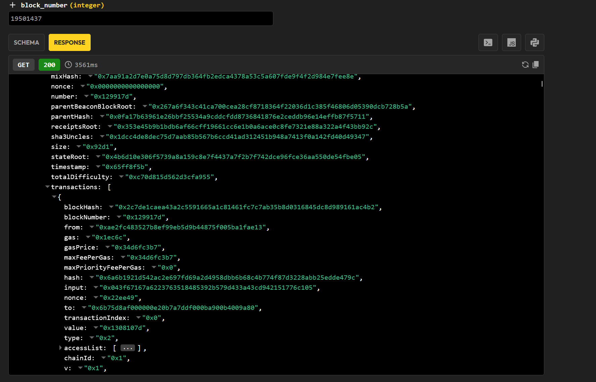


còn trong block 19501436 gasPrice: "0x377df74fb" tương ứng với gasUsed: "0x8d5da0"


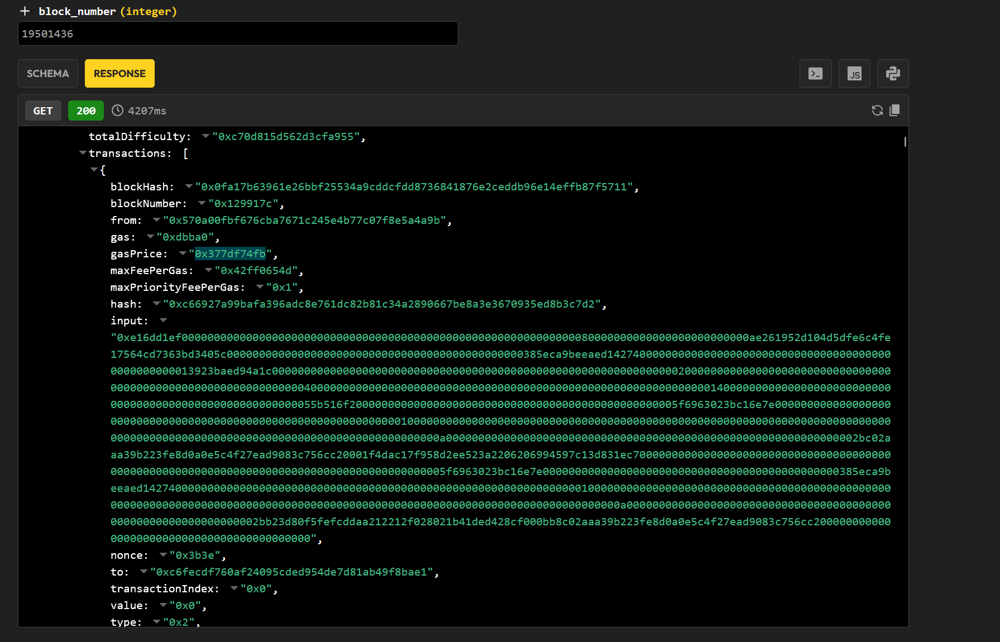


Ta có thể thấy gasPrice phụ thuộc vào gasUsed, giống như trên.

## 7. Gas

Dưới đây là bản **tóm tắt** các nội dung chính của trang “Gas and fees” từ Ethereum (ethereum.org) — phù hợp với việc bạn đang nghiên cứu về blockchain và việc vận hành mạng lưới:

---

### 1. Khái niệm “gas”

* “Gas” là đơn vị đo lường lượng công việc tính toán cần để thực thi các thao tác (opcodes, smart contract, giao dịch…) trên mạng Ethereum.
* Mỗi giao dịch trên mạng cần trả phí gas để đảm bảo mạng không bị spam hoặc bị kẹt bởi các vòng lặp vô hạn.
* Phí gas được trả bằng đồng Ether (ETH). Trong đó, “gwei” là đơn vị thường dùng — 1 gwei = 10⁻⁹ ETH.


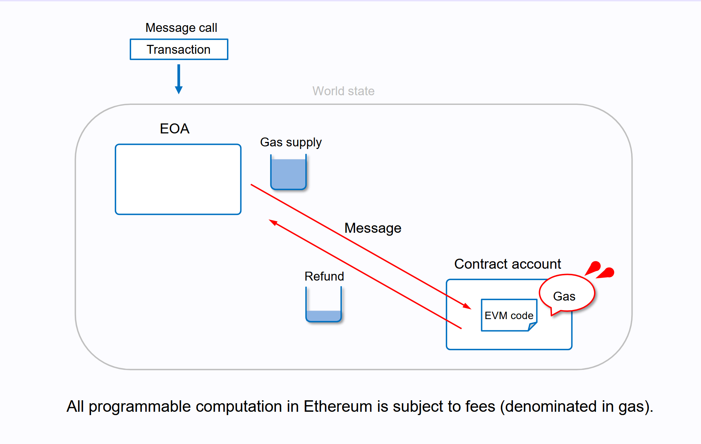


---

### 2. Cách tính phí gas

* Tổng phí phải trả = **số đơn vị gas đã sử dụng** × **(base fee + priority fee)**.
* **Base fee**: mức giá tối thiểu do protocol , mỗi block có một base fee. Nếu đặt giá thấp hơn base fee thì giao dịch không được chọn vào block. Lượng base fee này bị “đốt” (burn) — tức là bị loại khỏi lưu thông. base fee được tính độc lập với khối hiện tại và thay vào đó được xác định bởi các khối trước đó.
* **Priority fee (tip)**: phần phí thêm do người dùng quyết định để khuyến khích validator/block proposer ưu tiên giao dịch của mình hơn các giao dịch khác.

* Ví dụ minh họa: chuyển ETH cần ~21,000 gas; nếu base fee = 10 gwei và tip = 2 gwei → phí = 21,000 × (10 + 2) = 252,000 gwei = 0.000252 ETH. Trong đó 21,000 × 10 gas sẽ được đốt, phần còn lại tương ứng với 21,000 × (2) thì các validator sẽ nhận được

* **Gaslimit**: là mức tối đa đơn vị gas người dùng cho phép giao dịch sử dụng. Ví dụ: nếu đặt gas limit thấp hơn mức cần thiết thì giao dịch sẽ thất bại và toàn bộ gas đã dùng (cho việc thực thi tới điểm thất bại) vẫn bị tính phí. 

* Khi mạng đông đúc, nhiều người gửi giao dịch cùng lúc → cạnh tranh tăng tip để được xác nhận nhanh hơn. → Phí tổng cộng cao hơn. 
* Các smart contract phức tạp thực hiện nhiều thao tác tính toán → sử dụng nhiều gas → chi phí cao hơn. 


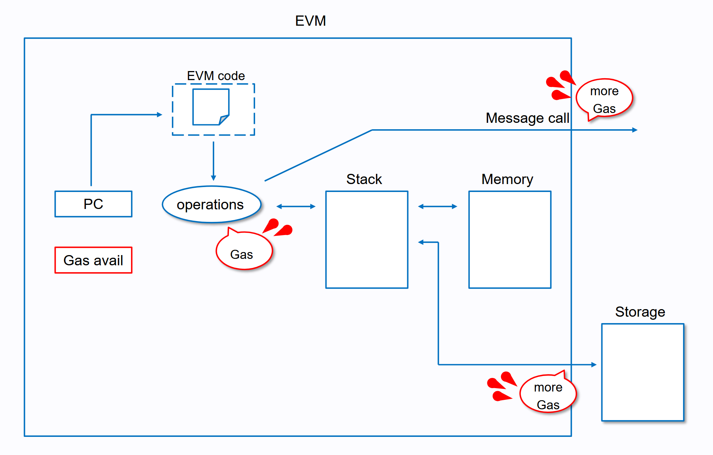


---
